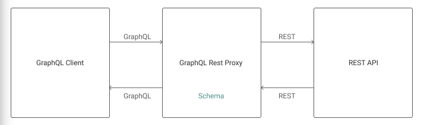

# Simple GraphQl Proxy

A simple GraphQL proxy for the popular [jsonplaceholder](https://jsonplaceholder.typicode.com/) REST endpoint.


*Image [source](https://www.npmjs.com/package/graphql-rest-proxy)*

## Available Endpoints
- GET [/post](https://jsonplaceholder.typicode.com/posts)
```
  {
    posts {
      userId
      id
      title
      body
      users
    }
  }
```
- GET [/users](https://jsonplaceholder.typicode.com/users)
```
  {
    users {
      id
      name
      username
      email
      phone
      website
      company {
        name
        catchPhrase
        bs
      }
      address {
      street
      suite
      city
      zipcode
        geo {
          lat
          lng
        }
      }
    }
  }
```

## Installation
```
npm install

npm start
```

## Acknowledgements
* [jsonplaceholder](https://jsonplaceholder.typicode.com/)
* [Haseeb](https://haseeb-anwar.medium.com/)
